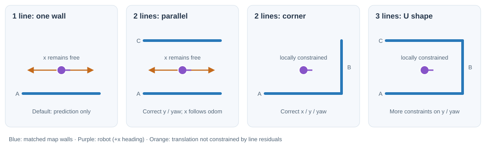
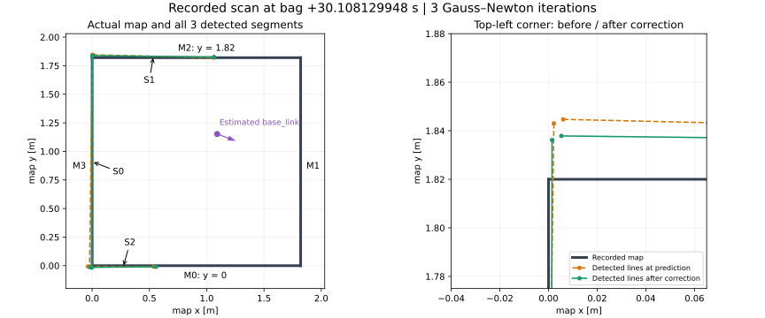

# ransac_localizer

## 役割

`ransac_localizer` は「odom から予測した位置・向き」を出発点に、LiDAR で見えた壁と地図の壁を重ねて自己位置を補正します。求めるのは 2D pose {math}`x=(p_x,p_y,\theta)`、つまり地図上の x 座標・y 座標・向きの3変数です。

名前に RANSAC とありますが、点群から RANSAC で線分を抽出するのは前段の [`line_detector`](../sensing/line-detector.md) です。このノードでは、非平行な観測線分2本を仮説として全列挙し、各仮説を odom の予測値から Gauss–Newton 最適化します。各候補を検出線分全体でscore評価し、最小scoreの候補だけを採用します。地図全体から位置候補をランダムに探索する処理ではありません。

## まず「何本見えれば位置が決まるか」

**本数に加えて、壁の向きと、正しい地図線分に対応付けられているかが重要です。** 以下は、長さのある線分が正しく対応し、真の姿勢に近い場所で補正する場合の説明です。

| 対応した観測線分 | 線分だけで分かること | 現在の実装の動作（`min_correspondences: 2`） |
| --- | --- | --- |
| 0本・1本 | 1本なら壁までの距離と壁に対する向き。壁に沿う位置は不明 | 線分による補正を行わず、odom 予測値を採用 |
| 平行な2本 | 壁に垂直な位置と向き。壁に沿う位置は不明 | ペアを候補から除外し、odom予測値を採用 |
| 非平行な2本 | x・y・向きを局所的に拘束できる | 線分と odom の両方を使って3変数を補正 |
| 3本以上で、少なくとも2方向ある | x・y・向きを拘束し、追加線分を候補評価に使える | 2本ずつ作った候補を全線分で評価。最終姿勢の最適化は選択された2本だけ |
| 3本以上でもすべて平行 | 壁に沿う位置は依然として不明 | 非平行ペアがないため候補を作らず、odom予測値を採用 |



図のオレンジ色の両矢印は、線分残差だけでは区別できない移動方向です。非平行な壁でも、交わる角度が小さければ一部の方向が決まりにくくなります。直角に近い配置は、この曖昧さが小さい例です。

### 「1本」の数え方

ここでの本数は、**地図の線分に対応付けられた観測線分の数**です。点群の点数、端点数、地図上の異なる壁の数ではありません。

- 1本の観測線分は2端点を持つので、最適化には2つの距離残差が入ります。ただし `matches` は1だけ増えます。
- 3本を検出しても、非平行なペアを作れなければ補正候補はありません。
- 同じ壁が2本に分割されて検出されても、観測線分同士が平行なら候補ペアから除外されます。地図線分の重複を除く処理はありません。

### 候補生成と採用

各 callback では、まず5 cm未満の線分を除外します。残った観測線分の全ペアから、角度差が `parallel_angle_tolerance` 以下のペアを除外します。各非平行ペアについて、次の処理を行います。

1. その2本だけを使い、対応する地図線分に対する Gauss–Newton 補正を行います。
2. 補正後の2本が、距離・角度の厳しいインライア条件を両方満たさなければ候補を棄却します。
3. 候補姿勢を**全検出線分**で再評価します。各線分の距離・角度コストは上限1にクリップされ、インライア数が `min_correspondences` 未満の候補は棄却します。
4. 残った候補のscore（全線分のロバストコスト＋小さなodom予測との差）を比較し、最小scoreの候補姿勢を採用します。

従って、全線分は候補の選別に使われますが、最終姿勢の最適化に使われるのは選択された2本だけです。候補が1つも残らない場合は、今回の odom 予測値を採用します。

## 実測例：検出線分から候補姿勢を計算する

この節は、線分の対応付けと1つの候補ペアに対する数値計算を示す例です。記録データは現在のペア列挙処理を導入する前のものなので、ここに示す単一候補の反復値は計算式の説明用です。現在のcallbackでは、同じ手順を全非平行ペアに対して行い、全線分のscore比較で採用候補を決定します。

実機で記録した `rosbag2_2026_08_14-20_20_14` の `/raw_map`、`/line_segments`、`/odom`、`/localization_pose`、TF を使い、1回の補正を数値で追います。使用する観測は **bag 開始から30.108129948秒**、header stamp が `1786706445.008704423` のフレームです。このフレームには3本の検出線分が含まれています。

以下の地図・線分・入力 pose は記録データに基づきます。式中の値は読みやすい桁数に丸めています。丸め前の入力、全反復の行列・残差・結果は [計算データ JSON](../../../_static/ransac-recorded-example.json) から確認できます。



左は地図全体と3本の観測線分、右は左上の角の拡大です。オレンジは odom 予測値で配置した線分、緑は候補 pose で配置した線分です。現在の実装では、3本から作られた各2本の候補を比較し、最終的に選択された2本でロボットの位置・向きを補正します。残りの線分は候補のscore評価に使います。

### 1. 記録された地図と検出線分

`/raw_map` に記録されている地図は、次の4線分です。M0〜M3 はメッセージ内の順序に対応します。

| 地図線分 | 始点 → 終点（map、m） | 単位法線 n |
| --- | --- | --- |
| M0 | `(0, 0)` → `(1.82, 0)` | `(0, 1)` |
| M1 | `(1.82, 0)` → `(1.82, 1.82)` | `(-1, 0)` |
| M2 | `(1.82, 1.82)` → `(0, 1.82)` | `(0, -1)` |
| M3 | `(0, 1.82)` → `(0, 0)` | `(1, 0)` |

観測 `/line_segments` の frame は `picoscan_11_1` です。S0〜S2 はこの観測メッセージ内の順序です。

| 観測線分 | 始点（センサー座標、m） | 終点（センサー座標、m） |
| --- | --- | --- |
| S0 | `(0.928584, -0.267178)` | `(0.293599, 1.473402)` |
| S1 | `(0.925567, -0.270112)` | `(-0.072094, -0.623146)` |
| S2 | `(0.306862, 1.475879)` | `(-0.229764, 1.273832)` |

bag の静的 TF `base_link → picoscan_11_1` は、並進 `(-0.33, 0, 0.08) m`、yaw `π rad` です。平面上では、センサー座標の点 `(u, v)` を次のように `base_link` 座標へ変換します。

```{math}
s=R(\pi)\begin{bmatrix}u\\v\end{bmatrix}
+\begin{bmatrix}-0.33\\0\end{bmatrix}
=\begin{bmatrix}-u-0.33\\-v\end{bmatrix}
```

S0 の始点なら、`(0.928584, -0.267178)` → `(-1.258584, 0.267178)` になります。変換後の全線分は次のとおりです。

| 観測線分 | 始点（base_link、m） | 終点（base_link、m） |
| --- | --- | --- |
| S0 | `(-1.258584, 0.267178)` | `(-0.623599, -1.473402)` |
| S1 | `(-1.255567, 0.270112)` | `(-0.257906, 0.623146)` |
| S2 | `(-0.636862, -1.475879)` | `(-0.100236, -1.273832)` |

### 2. odom の移動を加えて予測値を作る

前回の補正済み pose と、前回・今回の処理に対応する odom は次の値です。pose の並びは `(x [m], y [m], yaw [rad])` です。

| 入力 | 値 |
| --- | --- |
| 前回の補正済み pose（map） | `(1.087028, 1.147606, -0.357724)` |
| 前回 odom | `(0.989885, 1.026651, -0.403254)` |
| 今回 odom | `(0.986531, 1.025313, -0.408758)` |

ここでは、記録された `map → odom` と `/localization_pose` の同時刻の組から処理に使われた odom を逆算し、同じ値が `/odom` の実レコードに存在することを確認しています。線分メッセージと odom は非同期なので、単に同じ header 時刻で補間した値ではありません。

前回 pose に odom の相対変換を合成します。

```{math}
x_0=x_{t-1}\circ(o_{t-1}^{-1}\circ o_t)
=(1.083739,\ 1.146118,\ -0.363228)
```

この {math}`x_0` が最適化の初期値であり、odom prior の中心です。

### 3. 各観測線分を地図に対応付ける

まず、予測値で S0 の始点を map 座標へ移します。

```{math}
q=R(-0.363228)
\begin{bmatrix}-1.258584\\0.267178\end{bmatrix}
+\begin{bmatrix}1.083739\\1.146118\end{bmatrix}
\simeq\begin{bmatrix}0.002198\\1.843030\end{bmatrix}
```

S0 の終点は `(-0.022663, -0.009592)` になります。S0 はほぼ縦向きで `x = 0` の近くにあるため、左の地図線分 M3 が対応候補になります。

各観測について、候補の中点から地図直線までの距離、角度差、線分外距離を計算します。今回選ばれる対応は次のとおりです。

| 観測 → 地図 | 中点の法線距離 [m] | 角度差 [rad] | 線分外距離 [m] | score |
| --- | ---: | ---: | ---: | ---: |
| S0 → M3 | 0.010233 | 0.013418 | 0.000000 | 0.013587 |
| S1 → M2 | 0.012470 | 0.023116 | 0.000000 | 0.018249 |
| S2 → M0 | 0.008093 | 0.003130 | 0.000000 | 0.008875 |

例えば S0 → M3 の score は `0.010233 + 0 + 0.25 × 0.013418 ≈ 0.013587` です。反対側の縦線 M1 は向きが合いますが、中点の距離が `1.830233 m` あり、距離しきい値 `0.8 m` を超えるため棄却されます。

ここで棄却できるのは、しきい値を超えた対応候補です。対応付け条件を通った誤検出線分も、候補ペアの厳しいインライア判定と全線分score評価を通過した場合に限り、自己位置へ影響します。具体的な挙動は[誤検出した直線の扱い](#false-line-association)で説明します。

S0・S1・S2 がそれぞれ M3・M2・M0 に対応し、対応数は3です。この例では3回の反復を通して対応先は変わりません。

### 4. 選択候補の端点残差を計算する

観測線分の両端それぞれについて、対応する地図直線までの符号付き距離 `r = nᵀ(q − a)` を求めます。

S0 → M3 では `n = (1, 0)` なので、残差はそのまま map 上の x 座標です。S1 → M2 では `r = 1.82 − q_y`、S2 → M0 では `r = q_y` です。

| 観測端点 | 対応 | 予測時の map 座標 [m] | 初回残差 r [m] |
| --- | --- | --- | ---: |
| S0 始点 | M3 | `(0.002198, 1.843030)` | 0.002198 |
| S0 終点 | M3 | `(-0.022663, -0.009592)` | -0.022663 |
| S1 始点 | M2 | `(0.006060, 1.844700)` | -0.024700 |
| S1 終点 | M2 | `(1.064060, 1.820239)` | -0.000239 |
| S2 始点 | M0 | `(-0.035940, -0.007195)` | -0.007195 |
| S2 終点 | M0 | `(0.537459, -0.008990)` | -0.008990 |

この旧記録例では全端点の残差が `0.15 m` 未満なので、初回の重みはすべて `w = 1 / 0.04² = 625` です。現在の実装でこの計算を補正に使うのは、列挙した候補ペアのうち選択された2本です。

S0 の始点を例にすると、位置・向きの微小変化に対する Jacobian は、

```{math}
J=[1,\ 0,\ -0.696912]
```

となります。この端点は `x` の変化と回転に反応し、`y` の平行移動には反応しません。`w JᵀJ` と `w Jᵀr` を選択候補の4端点分加算し、odom prior も加えます。

### 5. 連立方程式を解いて pose を更新する

初回は現在の候補が予測値そのものなので、prior の gradient はゼロです。一方、H の対角には `(1/0.15², 1/0.15², 1/0.10²)` を加えます。得られる行列とベクトルは次のとおりです。

```{math}
H=\begin{bmatrix}
1294.444444 & 0.000000 & 286.748667\\
0.000000 & 2544.444444 & -1727.073265\\
286.748667 & -1727.073265 & 2934.520950
\end{bmatrix},\qquad
g=\begin{bmatrix}
-12.790702\\
5.471703\\
-25.862376
\end{bmatrix}
```

`H Δx = −g` を解くと、初回の更新量は次の値になります。

```{math}
\Delta x=
\begin{bmatrix}0.007362\\0.005567\\0.011370\end{bmatrix}
```

つまり map 上で x を約7.36 mm、y を約5.57 mm、向きを約0.65°動かします。これを予測値に加え、更新した pose で残差・対応を計算し直します。

| 反復 | 更新 Δx [m] | 更新 Δy [m] | 更新 Δyaw [rad] | 更新後 pose `(x, y, yaw)` |
| --- | ---: | ---: | ---: | --- |
| 1 | 0.007362461 | 0.005567251 | 0.011370254 | `(1.091101, 1.151685, -0.351857)` |
| 2 | -0.000114536 | 0.000119036 | 0.000198282 | `(1.090987, 1.151804, -0.351659)` |
| 3 | -0.000000783 | 0.000002201 | 0.000003263 | `(1.090986, 1.151806, -0.351656)` |

3回目で更新量が並進 `1e-4 m` 未満、回転 `1e-4 rad` 未満となり終了します。

### 6. 記録された出力と照合する

最終結果は次のようになりました。

| 値 | x [m] | y [m] | yaw [rad] |
| --- | ---: | ---: | ---: |
| odom 予測値 | 1.083738978 | 1.146117996 | -0.363227541 |
| 実装による再計算 | 1.090986120 | 1.151806484 | -0.351655741 |
| bag の `/localization_pose` | 1.090986120 | 1.151806484 | -0.351655741 |

現在の C++ の `match()`・`solve()`・`optimize()` を変更せずに取り出した計算でも、記録された pose と各成分 `1e-12` 未満の差で一致しました。使用した標準偏差・しきい値は本ページの設定表と同じです。

補正後も観測線分が地図に完全一致するとは限りません。実測線分にはばらつきがあり、odom prior も加わるため、選択された2本のずれを重み付きで小さくした候補になります。採用時には、この候補を全検出線分のロバストscoreで再評価します。また、この照合は計算の再現性の確認であり、実際のロボットの真の位置を外部計測で検証したものではありません。

最後に、補正後 pose と今回の odom から TF を計算します。

```{math}
T^{map}_{odom}=x_t\circ o_t^{-1}
=(0.164579,\ 0.071862,\ 0.057102)
```

この補正を `map → odom` として配信します。`odom → base_link` は odometry 側の値を維持します。

## 入力から出力まで

線分メッセージを受信するたびに、次の処理を行います。

1. odom と地図線分があるか確認します。どちらかがなければ、その callback では出力しません。
2. 観測線分をメッセージの frame から `base_link` へ TF 変換します。TF が取得できない場合も出力しません。現実装は線分時刻ではなく最新の TF を参照します。
3. 前回からの odom の相対移動を、前回の補正済み pose に合成して予測値を作ります。
4. 非平行な観測線分2本の全ペアを列挙します。
5. 各ペアだけで対応付けと Gauss–Newton 補正を行い、厳しいインライア条件を満たす候補だけを残します。
6. 各候補を全検出線分でロバストscore評価し、最小scoreの候補を採用します。
7. 補正候補がなければ今回の予測値を採用し、`localization_pose` と `map → odom` を出力します。

空の線分配列が届いた場合は、地図・odom・TF の前提が満たされていれば予測値を出力します。一方、線分メッセージ自体が届かなければ、このノードは odom の受信だけでは pose を出力しません。


## Interface

| 種別 | 名前 | 型 / 内容 |
| --- | --- | --- |
| subscribe | `map` | `rogi_msgs/msg/Map` |
| subscribe | `odom` | `nav_msgs/msg/Odometry` |
| subscribe | `line_segments` | `rogi_msgs/msg/LineSegmentArray` |
| publish | `localization_pose` | `geometry_msgs/msg/PoseWithCovarianceStamped` |
| tf | `map -> odom` | 補正 pose と odom pose から計算 |

## Odom prediction

前回 odom {math}`o_{t-1}`、現在 odom {math}`o_t` から相対変換を求めます。

```{math}
\Delta o=o_{t-1}^{-1}\circ o_t
```

前回 map pose {math}`x_{t-1}` に合成して prediction を作ります。

```{math}
x_0=x_{t-1}\circ\Delta o
```

初回は初期 pose をそのまま prediction とします。

## 線分対応付け

観測線分の両端 {math}`s_0,s_1` を候補 pose {math}`x` で map 座標へ変換します。

```{math}
q_k=R(\theta)s_k+
\begin{bmatrix}p_x\\p_y\end{bmatrix},
\qquad k\in\{0,1\}
```

観測線分の中点と角度は、

```{math}
m=\frac{q_0+q_1}{2},\qquad
\theta_o=\operatorname{atan2}(q_{1y}-q_{0y},q_{1x}-q_{0x})
```

地図線分 {math}`l=(a,b)` の方向 {math}`d=b-a`、長さ {math}`L=\|d\|`、法線 {math}`n=(-d_y/L,d_x/L)` に対し、角度差、法線距離、線分外距離を計算します。

```{math}
\alpha=|\operatorname{wrap}(\theta_o-\theta_l)|,\qquad
\Delta\theta=\min(\alpha,|\pi-\alpha|)
```

```{math}
d_\perp=|n^T(m-a)|
```

```{math}
u=\frac{(m-a)^T d}{L^2},\qquad
d_{\mathrm{out}}=\max(0,\max(-u,u-1))L
```

対応候補の score は、

```{math}
J_{\mathrm{assoc}}=d_\perp+d_{\mathrm{out}}+0.25\Delta\theta
```

です。以下の3条件をすべて満たす候補の中で、score 最小の地図線分を対応にします。

- `Δθ < max_angle_difference`：sample では `0.35 rad`（約20.1°）未満。
- `d_perp < max_association_distance`：sample では `0.8 m` 未満。
- `d_out < max_association_distance`：同じく `0.8 m` 未満。

上の実測例では S0 → M3 の score は約 `0.013587` でした。S0 → M1 は向きが合っていても、法線距離が `1.830233 m` のため候補から外れます。score の係数 `0.25` は実装に固定されています。

線分の端点順が逆でも同じ向きとして扱うため、角度差は180°反転を同一視します。ただし、これは対応先の判別が常に一意になるという意味ではありません。対称な部屋や繰り返しの多い地図では誤対応し得ます。

線分外距離 `d_out` は**対応先の選択**にだけ使います。後段の補正残差は地図線分を延長した直線への距離であり、観測端点を地図端点に引き寄せる項はありません。そのため、有限長の壁を地図に登録しても、対応が変わらない範囲では壁に沿う移動を連続的に補正できません。

(false-line-association)=
### 誤検出した直線の扱い

誤検出線分が対応付け条件を満たす可能性は残りますが、現在はその線分を含むペアをそのまま採用しません。候補生成後、ペアの両方に対して距離・角度を組み合わせた厳しいインライア判定を行います。さらに、候補を全検出線分で再評価し、各線分のコストを上限1にクリップします。そのため、誤検出線分1本の大きな残差が、正しい複数線分の評価を圧倒することはありません。

例えば、上の4壁の地図に対し、現在の pose で map 座標へ変換した誤検出線分が `(0.30, 0.40)` → `(0.30, 1.40)` だったと仮定します。対応付けだけならM3（`x = 0`）に近い候補になります。しかし現在の実装では、この線分を含む非平行ペアを候補として最適化した後、ペア両方の距離・角度インライア判定を行います。誤検出線分が他方の線分と整合しなければ、その候補は棄却されます。残った候補でも、この線分のscoreは上限1にクリップされるため、他の正しい線分の評価を単独で圧倒しません。

候補が成立しない場合は、そのcallbackの補正を行わず予測値へ戻ります。採用されたposeは次回のodom予測の起点になるため、厳しい判定を通過した誤候補が残る可能性はありますが、外れ値1本だけで候補全体が大きく引き寄せられないようになっています。

## Gauss-Newton 補正

選択された候補ペアに対応する地図線分について、観測線分端点 {math}`s` の map 座標は、

```{math}
q=R(\theta)s+p
```

残差は地図線分法線方向の signed distance です。

```{math}
r=n^T(q-a)
```

pose {math}`(p_x,p_y,\theta)` に対する Jacobian は、

```{math}
J=
\begin{bmatrix}
n_x &
n_y &
n_x(-\sin\theta\,s_x-\cos\theta\,s_y)+
n_y(\cos\theta\,s_x-\sin\theta\,s_y)
\end{bmatrix}
```

robust weight は、

```{math}
w=
\frac{1}{\sigma_z^2}
\begin{cases}
1 & |r|<0.15\\
0.15/|r| & |r|\ge 0.15
\end{cases}
```

です。Hessian と gradient を加算します。

```{math}
H\leftarrow H+wJ^TJ,\qquad
g\leftarrow g+wJ^Tr
```

odom prior も対角項として足します。

```{math}
H_{ii}\leftarrow H_{ii}+\frac{1}{\sigma_i^2},\qquad
g_i\leftarrow g_i+\frac{x_i-x_{0i}}{\sigma_i^2}
```

回転成分の prior 差は `wrap(θ − θ₀)` とし、±π の境界をまたぐ差を正規化します。

線形方程式を解いて pose を更新します。

```{math}
H\Delta x=-g,\qquad x\leftarrow x+\Delta x
```

候補ペアのどちらかが対応できなくなった場合、または連立方程式の消去処理で pivot の絶対値が `1e-10` 未満になった場合、その候補の `optimize()` は失敗を返します。全候補が失敗またはインライア条件不成立なら、その callback の補正全体を破棄し、最初の prediction を採用します。

平行線のペアは `parallel_angle_tolerance` により候補生成時点で除外します。したがって、平行線だけが見えているcallbackでは線分補正を行わず、odom予測値を採用します。逆に、非平行ペアでsolverが解けたことは、線分が正しい地図壁であることの保証ではありません。厳しいインライア判定と全線分score評価を通過した候補だけが採用されます。

更新量が並進 `1e-4 m` 未満かつ回転 `1e-4 rad` 未満になると反復を終了します。最大反復回数に達した場合も、途中で失敗しなければ補正値を採用します。残差の改善量や最終残差に対する合否判定は実装されていません。

### odom と線分のどちらを信じるか

標準偏差が小さいほど、その項の重みは大きくなります。

| 設定変更 | 補正への影響 |
| --- | --- |
| `measurement_stddev` を小さくする | 壁への一致を強く求める |
| `odom_translation_stddev` を小さくする | x・y を odom 予測から動かしにくくする |
| `odom_rotation_stddev` を小さくする | θ を odom 予測から動かしにくくする |

sample では残差が `0.15 m` 未満のとき、端点1つの線分重みは `1 / 0.04² = 625`、並進の prior 重みは `1 / 0.15² ≈ 44.44` です。ただし Jacobian と端点数が異なるので、この比をそのまま「信頼度の比率」とは解釈できません。

残差が `0.15 m` 以上になると重みを下げますが、ゼロにはしません。例えば `0.30 m` の端点は通常の半分の重みで残ります。外れ値を完全に除去する仕組みではなく、誤対応の影響が残ることがあります。

## map -> odom

補正後 pose を {math}`x_t`、最新 odom pose を {math}`o_t` とすると、

```{math}
T^{map}_{odom}=x_t\circ o_t^{-1}
```

を TF として publish します。

## 設定ファイル

sample では `example/sample/config/localization/ransac/config.yaml` の `ransac_localizer.ros__parameters` を使います。`rogi_nav.launch.py` は `localization.method == ransac` のとき、この YAML を `ransac_localizer` に渡します。

| key | sample 値 | 数式上の意味 |
| --- | --- | --- |
| `initial_pose_x/y/a` | ノード既定値は `0.0`。launch から初期位置を指定 | 初期 pose。`a` の単位は rad |
| `map_frame_id` | `map` | `localization_pose` frame と TF 親 frame |
| `odom_frame_id` | `odom` | `map -> odom` の child frame |
| `base_frame_id` | `base_link` | 観測線分を変換する基準 frame |
| `max_iterations` | `8` | Gauss-Newton 最大反復回数 |
| `min_correspondences` | `2` | 補正を成立させる最小対応線分数 |
| `max_association_distance` | `0.8` | {math}`d_\perp` と {math}`d_{\mathrm{out}}` のしきい値 |
| `max_angle_difference` | `0.35` | 対応付けの角度差しきい値 |
| `parallel_angle_tolerance` | `0.10` | この値以下の角度差を持つ観測線分ペアを平行として除外 [rad] |
| `min_line_length` | `0.05` | 観測線分を候補に使う最小長さ [m] |
| `score_distance_threshold` | `0.10` | scoreの距離インライア尺度 [m] |
| `score_angle_threshold` | `0.10` | scoreの角度インライア尺度 [rad] |
| `odom_translation_stddev` | `0.15` | odom prior の {math}`\sigma_x,\sigma_y` |
| `odom_rotation_stddev` | `0.10` | odom prior の {math}`\sigma_\theta` |
| `measurement_stddev` | `0.04` | 線分残差 weight の {math}`\sigma_z` |

`example/sample/config/localization/config.yaml` は次を決めます。

| key | sample 値 | 対応 |
| --- | --- | --- |
| `localization.method` | `ransac` | このノードを主 localizer として使う指定 |
| `topics.localization_scan` | `/scan_for_localization` | `line_detector` 入力にも使われる scan topic |
| `topics.odom` | `/odom` | `odom` subscription の remap 先 |
| `topics.localization_pose` | `/localization_pose` | publish 先 |

地図入力は `map/config.yaml` の `topics.raw_map`、sample では `/raw_map` へ remap されます。観測線分 topic は `line_detector` と共通の default `line_segments` を使います。両ノードは sensing / localization の別 container で起動します。


## 実際の動作を読むときの注意

- **初期位置は必要です。** 対応付けは予測位置の近くで行います。初期位置や odom が大きくずれると、対応がなくなって予測値だけを出力し続けたり、別の壁へ対応したりします。自動で地図全体を探索して復帰する処理はありません。
- **対応数は品質指標の一部です。** `min_correspondences` を増やすと少数の線分での補正を抑えられますが、独立した方向の数や正しい対応を保証しません。少ない本数しか見えない場所では、補正を見送る頻度も増えます。
- **出力 covariance は状況に応じて変わりません。** `publish()` は x・y に `measurement_stddev²`、yaw に `odom_rotation_stddev²` を設定します。sample ではそれぞれ `0.0016 m²`、`0.01 rad²` で、最適化した行列の逆行列ではありません。候補がなく予測値を採用した場合や、平行線しかなく補正しない場合も同じ値です。covariance だけを見て「今回は壁で位置が十分に決まった」と判断できません。
- **地図の円はこの補正では使いません。** `Map` メッセージのうち `line_segments` を取り出して対応付けています。

実装参照：[ransac_localizer.cpp](https://github.com/KeioRoboticsAssociation/rogi_nav/blob/main/rogi_localization/2d_lidar/ransac_matching/src/ransac_localizer.cpp) の `match()`（対応）、`optimize()`（補正）、`on_lines()`（予測・採否）、`publish()`（pose・TF・covariance）。
